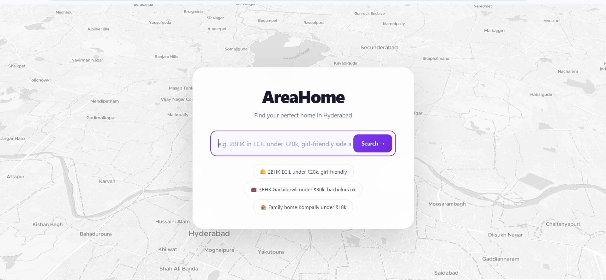
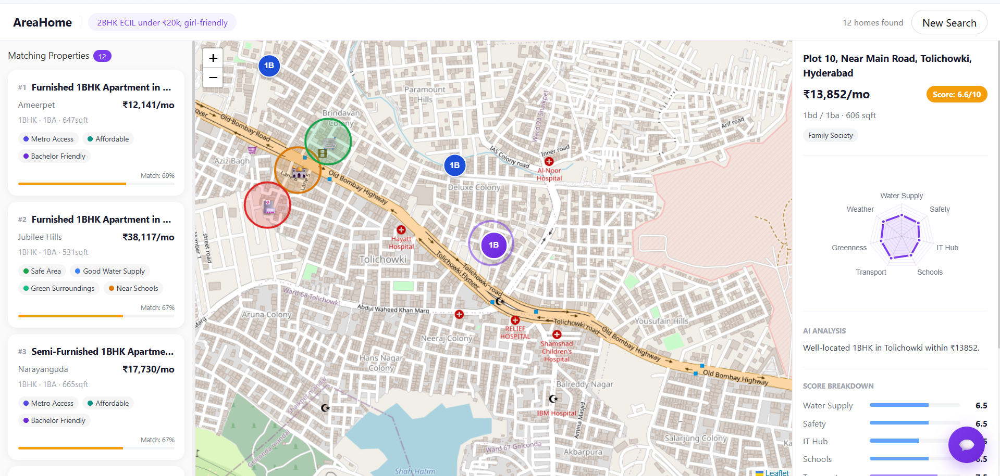
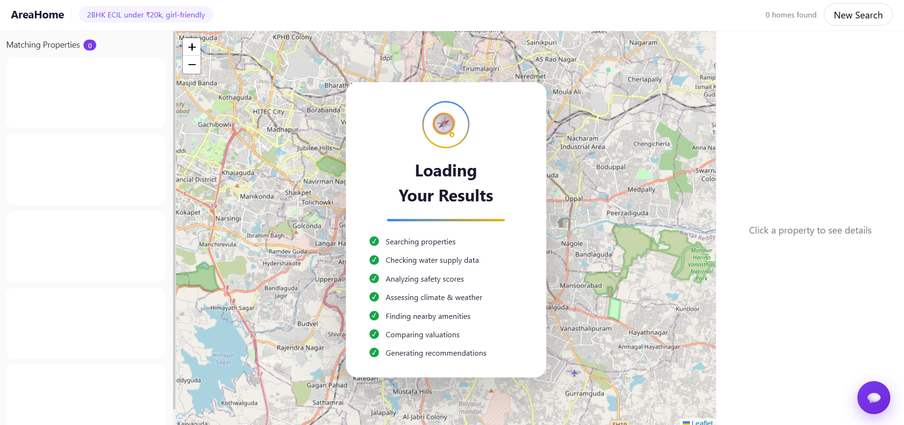

# 🏡 AreaHome — Intelligent Property Recommendation Platform

🌐 **Live Demo:**
👉 https://areahome-hyd.vercel.app

A full-stack intelligent rental search platform that converts **natural language queries** into **personalized, location-aware property recommendations**.

> 💬 Example:
> **"2BHK in ECIL under ₹20k, girl-friendly"**

---

## 🚀 Overview

AreaHome reimagines property search by replacing rigid filters with **natural language understanding and intelligent ranking**.

Users can describe requirements in plain English. The system extracts intent (budget, BHK, location, preferences) and ranks properties using a **custom multi-factor scoring engine**.

---

## ✨ Key Features

### 🔍 Natural Language Search

* Understands human-like queries
* Extracts:

  * Budget
  * BHK
  * Location
  * Social preferences
* Handles flexible and incomplete inputs

---

### 🧠 Intelligent Recommendation Engine

* Priority-based ranking:

  * Exact BHK match → highest priority
  * Smart fallback logic
* Handles no-result cases using:

  * Nearby areas
  * Similar price ranges

---

### 🗺️ Interactive Map Experience

* Real-time property markers
* Area visualization
* Nearby amenities
* Synced map + listings

---

### 📊 Multi-Factor Scoring System

Evaluates properties based on:

* Water Supply
* Safety
* IT Hub Proximity
* Schools
* Transport
* Greenness
* Weather

👉 Generates a **final score (0–100)**

---

### 👩 Social-Aware Recommendations

* Girl-friendly areas
* Bachelor-friendly filtering
* Family-oriented locations

---

### ⚡ Performance Optimizations

* Async backend processing
* Fast response times
* Optimized scoring pipeline

---

## 💼 Engineering Highlights

* Built a **custom recommendation engine** (not just filtering)
* Designed **multi-factor scoring system**
* Implemented **natural language parsing logic**
* Developed **fallback ranking strategy**
* Optimized system using **async processing**
* Deployed full-stack application (frontend + backend separation)

---

## 🛠️ Tech Stack

### Frontend

* React (Vite)
* Tailwind CSS
* Leaflet / MapLibre
* Chart.js

### Backend

* FastAPI (Python)
* AsyncIO
* Custom scoring engine

---

## 🏗️ Architecture

```id="arch1"
Frontend (React)
        ↓
API Layer
        ↓
Recommendation Engine
        ↓
Property Dataset
```

---

## 📸 Screenshots

### 🏠 Home Page



---

### 📊 Results Page



---

### ⏳ Loading State



---

## ⚙️ Local Setup

### Backend

```bash id="cmd1"
cd backend
pip install -r requirements.txt
uvicorn main:app --reload
```

### Frontend

```bash id="cmd2"
cd frontend
npm install
npm run dev
```

👉 http://localhost:5173

---

## 📌 Project Status

* ✅ Live in production
* ✅ Fully functional full-stack system
* 🔜 Enhancements in progress

---

## 🚀 Future Improvements

* Database integration
* Geo-based ranking
* Authentication
* Personalization

---

## 👨‍💻 Author

**Mohd Sameer**
🔗 https://github.com/mohdsameer18n

---

## ⭐ Support

If you found this useful, give it a ⭐
